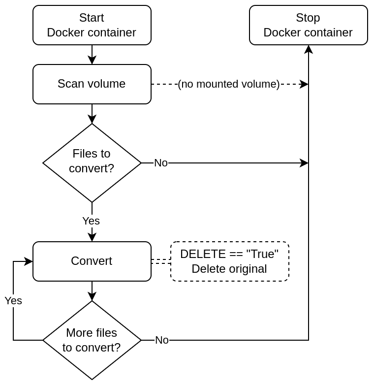

# H.265 Converter

## Description
Scan a directory for video files that need to be converted to h.265 HVC1 MP4 format, and process the findings. These are possible scan results:

* MKV (convert) - All MKV will be converted to MP4 even if it's h.265 HVC1
* MP4 (convert) - Convert MP4 if not h.265 HVC1
* MP4 (skip) - MP4 is already h.265 HVC1

### CAVEAT
The conversion is for **ONE** video stream (video track 0, usually track 0) and **ONE** audio stream (audio track 0, usually track 1). If the file has multiple audio tracks (i.e.: anime dubs), it may choose the wrong language, as there is no standard for ordering tracks. Furthermore, as this will only use those two tracks, all others will be ignored, including subtitles. Extract any subtitles with `mkvextract` prior to conversion as original files can be deleted after a successful conversion (see "Environment Variables" below).

## How It Works
Once the container starts, it scans the mounted volume for video files to convert and update metadata. If no files are found, or nothing to convert, the container will shut itself down. The found files will be inserted into the SQLite database, and queued for processing. After scans are complete, the conversion will begin for files with a *convert* value. Conversion results will be *failed* or *done*.  

During the conversion process, the output file will have the *Title* metadata updated to match the filename (without extension), and the *Comment* tag removed.

## Docker

### Pull the image
The image is available on Docker Hub:

`docker pull draikx21/h265_converter`

### Build an Image
Build the docker image using the following command:

`docker build -f docker/Dockerfile [-t <image_name:tag>] .`

### Run a Container
***DOCKER COMPOSE***  
Use the provided **docker-compose.yaml** file, and ensure the variables are properly set. Additionally, set the local directory to scan is mounted to "/mnt" within the container.

***MANUALLY***  
All variables and volumes are specified at the time of execution.

`docker run -e key=value -e key=value -v /path/to/videos:/mnt <image_name[:tag]>`

### Environment Variables

***BATCH*** (default = 0)  
This is for the amount of video files to convert. The default value is "0" (zero) which is unlimited, and will go through all of the video files it found in the scan. The list depends on the result order from the `os.walk` scan, as the limit is for the top batch count.

:exclamation: Be mindful of the resource usage, and overworking your machine for long periods of video conversions.

***DEBUG***  (default = "False")  
Pertains to the log file, not stdout logging. It will log all INFO-level and higher messages. Set the value to "True" to enable DEBUG-level stdout logging. 

***DELETE*** (default = "False")  
Once a video file has been successfully converted to h.265, the original file can be removed. Set value to "True" to enable this action.

### Reading the Docker Logs (stdout logging)
The console output is setup with DEBUG-level logging. While the Docker container is running, the console will display the current actions, but all console output is available in the Docker logs, even after it shuts down (and container is not removed). Read the Docker logs with the following command:

`docker logs [-f] <container_name>`

### Volumes
The volume mounted to '/mnt' is the scanned directory. It is set by the *volume* local directory value in the **docker-compose.yaml** file. Ensure that the volume is updated before starting the container. The container will terminate right after the scan, if it will not have any conversions to perform.

The mounted volume will be scanned recursively. This can be used to specify the depth of video conversions. For example, Plex TV series have a folder structure of the root directory, the show name, then the season folder, which contain the respective episodes.

* TV Shows
  * Random Show
    * Season 01
    * Season 02
    * Season 03
  * Some Other Show
    * Season 01
    * Season 02

Mounting 'Random Show' will scan all of its season directories for video files to convert. However, mounting a specific season will only scan that directory for video files that need to be converted to h.265 HVC1 MP4. If the root folder containing all of the TV shows is mounted, it will scan all of the TV shows and respective seasons for videos to convert.

Movies are typically one flat directory. Mounting the directory will scan and process all video files. This is when setting the **BATCH** environment variable can help ensure the conversions are not running for days.
